[English](./README.md) | العربية

<p align="center">
  
</p>

<h1 align="center">Jahiz Analytics — منصة جاهز لتحليلات الكاراتيه</h1>

<p dir="rtl" align="center">
  <strong>من كل مباراة إلى تطور وأداء قابل للقياس</strong><br />
  دراسة هندسية معمارية شاملة لتطبيق إنتاجي متكامل ومتاح رسمياً على متاجر التطبيقات
</p>

<p align="center">
  <a href="https://apps.apple.com/us/app/jahiz-analytics/id6788289047" aria-label="تحميل تطبيق جاهز من App Store">
    
  </a>
  &nbsp;&nbsp;&nbsp;
  <a href="https://play.google.com/store/apps/details?id=com.jahiz.analytics" aria-label="تحميل تطبيق جاهز من Google Play">
    
  </a>
</p>

<p align="center">
  
  
  
  
  
  
  
  
  
</p>

---

> ### ⚡ ملخص تنفيذي للمسؤولين الهندسيين ومسؤولي التوظيف (قراءة سريعة في 30 ثانية)
> **تطبيق جاهز (Jahiz Analytics)** هو منصة رياضية إنتاجية تجارية تعمل على أنظمة **iOS (App Store)** و **Android (Google Play)**. تم تصميم وهندسة وبناء النظام بالكامل وصيانته بواسطة **شوقي السيد** كمهندس معماري ومطور برمجيات وحيد (أكثر من 735 حفظ برمجي Git Commit).
>
> يقوم النظام بحل مشكلة تسجيل أحداث مباريات الكاراتيه الأولمبية (WKF) في أجزاء من الثانية، وتحويلها إلى تحليلات فنية متقدمة تخدم المدربين واللاعبين:
> - **واجهة أمامية متعددة المنصات**: مبنية بأحدث معايير Angular 20 Standalone مع Ionic 8 و Capacitor 7 وإدارة حالة دقيقة عبر NgRx 20، مع دعم ثنائي الاتجاه بالكامل (العربية من اليمين لليسار RTL والإنجليزية LTR) بدون أي انزياح في التخطيط (0 CLS).
> - **خلفية برمجية عالية الأداء**: معتمدة على Node.js 22 ESM مع PostgreSQL 17 بنظام معاملات محكم (ACID Transactions)، طابور مهام موزع معتمد على قاعدة البيانات (`FOR UPDATE SKIP LOCKED`)، ونظام ترحيلات متسلسل يضم 37 ملف ترحيل SQL.
> - **صرامة هندسية وجودة موثقة**: يضم المشروع **390 ملف اختبار آلي** (219 في الواجهة و 171 في الخادم)، ونظام نشر آلي متكامل عبر GitLab CI/CD بست مراحل، وتكامل مباشر مع Codemagic لنظام iOS و Fastlane لنظام Android.

---

<p align="center">
  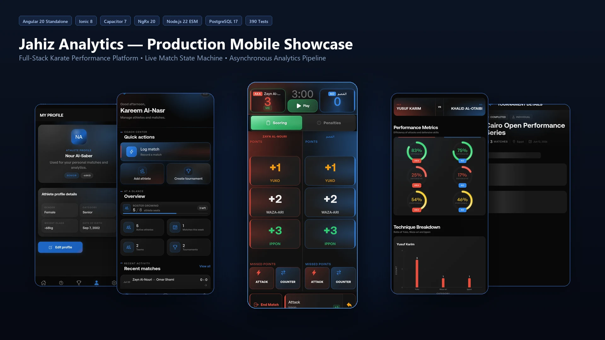
</p>

---

## 📊 نظرة هندسية شاملة

| المحور الهندسي | المواصفات الإنتاجية | المبررات المعمارية والتحقق |
| :--- | :--- | :--- |
| **إطار الواجهة الأمامية** | **Angular 20 Standalone + Ionic 8** | معمارية مكونات حديثة تلغي أعباء وحدات NgModule القديمة وتسرع عملية التحميل. |
| **بيئة تشغيل الهاتف** | **Capacitor 7** | وصول مباشر لميزات الهاتف الأصلية (الكاميرا، الاستجابة اللمسية Haptics، التخزين الآمن). |
| **إدارة الحالة** | **NgRx 20 (Actions, Reducers, Effects, Selectors)** | آلة حالة حتمية (Deterministic State Machine) مع تحديثات تفاؤلية وطابور مهام محلي. |
| **بيئة تشغيل الخادم** | **Node.js 22 LTS (Strict ESM)** | وحدات معيارية ECMAScript قياسية تضمن توافقاً تاماً مع كود TypeScript المشترك. |
| **قاعدة البيانات الأساسية** | **PostgreSQL 17 via pg Pool** | تكامل علائقي محكم، 37 ترحيلاً، حذف مرن (Soft Deletes)، وفهارس فريدة جزئية. |
| **طابور المهام الموزع** | **PostgreSQL `FOR UPDATE SKIP LOCKED`** | جدولة ومعالجة غير متزامنة لمهام التحليلات بدون الحاجة لأدوات خارجية مثل Redis. |
| **هرم الاختبارات** | **390 ملف اختبار (219 للواجهة، 171 للخادم)** | اختبارات وحدة، اختبارات متاجر الحالة، اختبارات تكامل للواجهات، واختبارات مسار كامل. |
| **خط النشر والتشغيل** | **GitLab CI/CD + Codemagic + Fastlane** | نشر آلي عبر 6 مراحل: التحقق، البناء، التدقيق، بيئة المعاينة، ومتاجر التطبيقات. |
| **التعريب والاتجاه** | **ثنائي اللغة والاتجاه (عربي RTL / إنجليزي LTR)** | نظام تصميم معتمد على الرموز الرياضية HSL، خصائص CSS المنطقية، وأنبوب أرقام عربية مخصص. |
| **الملكية الهندسية** | **+735 حفظ برمجى (المهندس المعماري الوحيد)** | تأليف كامل وبناء شامل بنسبة 100% للواجهات، الخوادم، المكتبات المشتركة، وقواعد البيانات. |

---

<p align="center">
  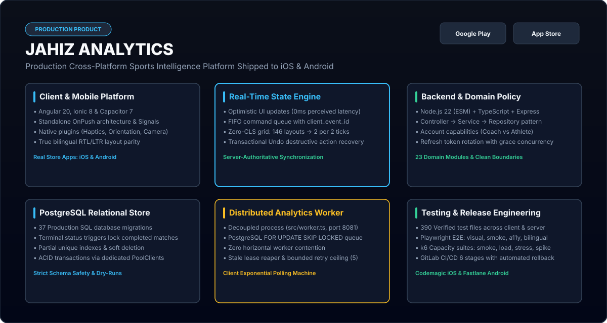
</p>

---

## 📱 استعراض فيديو لتطبيق الهاتف والمعمارية

شاهد التطبيق الميداني الفعلي أثناء العمل، مستعرضاً تسجيل النقاط المباشر، وتزامن المؤقت مع الأحداث، والواجهة التفاؤلية المرنة ضد انقطاع الشبكة، وشاشات التحليلات:

<p align="center">
  <a href="./assets/demo/jahiz-demo-full.mp4">
    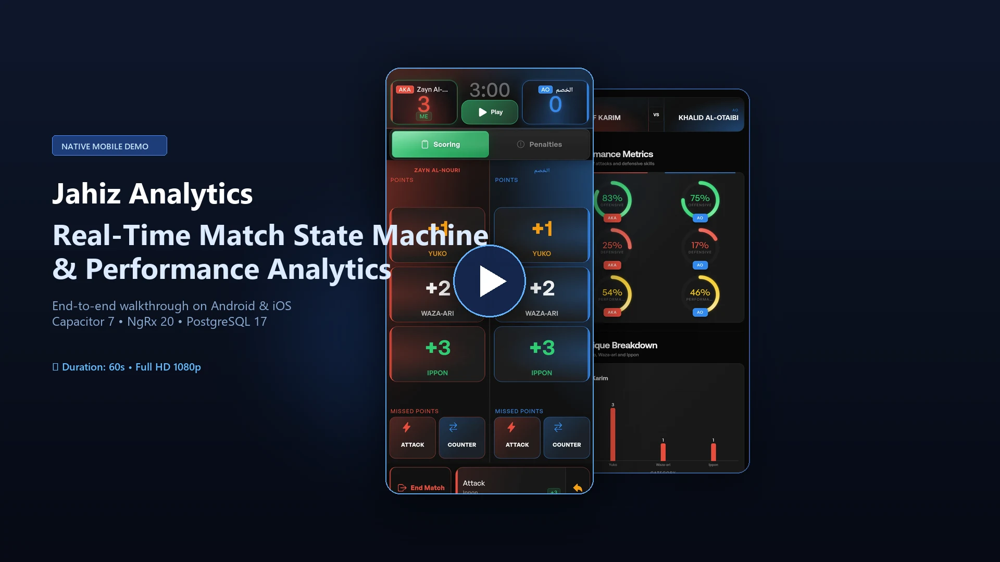
  </a>
  <br />
  <em>▶️ <a href="./assets/demo/jahiz-demo-full.mp4"><strong>استعراض المنتج الكامل (MP4، 59.5 ثانية، 710 كيلوبايت)</strong></a> &nbsp;|&nbsp; ⚡ <a href="./assets/demo/jahiz-demo-recruiter.mp4"><strong>النسخة السريعة لمسؤولي التوظيف (MP4، 28.7 ثانية، 923 كيلوبايت)</strong></a></em>
</p>

---

<p align="center">
  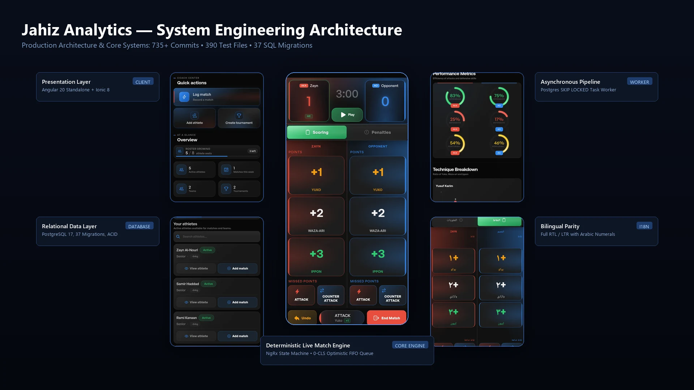
</p>

---

## 🏛️ المعمارية العامة للنظام

تم تنظيم المشروع في مستودع موحد (**npm workspaces monorepo**) يفصل بدقة بين العرض وقواعد الأعمال البرمجية والنماذج المشتركة:

```
jahiz-monorepo/
├── client/          # تطبيق الهاتف (Angular 20 + Ionic 8 + NgRx 20 + Capacitor 7)
├── server/          # واجهة برمجة التطبيقات والعامل المعالج (Node.js 22 ESM + PostgreSQL 17)
├── shared/          # الواجهات البرمجية المشتركة (DTOs, Enums, ErrorCodes)
├── docs/            # التوثيق المعماري، سجلات القرارات الهندسية (ADRs)، وأدلة التشغيل
└── tools/           # أدوات الأتمتة، Fastlane، وأنابيب تصدير لقطات الشاشة
```

<p align="center">
  
</p>

---

## 🔬 الركائز الهندسية الأربع الكبرى

### 1. آلة حالة المباريات المباشرة وتصفير انزياح التخطيط (Zero-CLS Optimistic UI)
في مباريات الكاراتيه التنافسية، تبلغ مدة المباراة 3 دقائق فقط وتتسم بضربات سريعة متتالية (يوكو، وازاري، إيبون) وإنذارات فورية. أي بطء أو تجميد في الشاشة قد يفقد المدرب لحظة التسجيل.

- **طابور التحديثات التفاؤلية**: يتم تطبيق الأحداث على الفور في حالة NgRx المحلية، مما يضمن استجابة مرئية في أجزاء من الثانية مع وضع العمليات في طابور محلي (FIFO) يُرسل إلى الخادم.
- **استقرار التخطيط وتصفير CLS**: أثبتت اختبارات الأداء خفض عمليات إعادة تخطيط الصفحة من **146 عملية إلى عمليتين فقط لكل نبضتي مؤقت**، مع **ثبات تام لشريط الأدوات السفلي (0 بكسل انزياح)** أثناء عرض رسائل التنبيه والشبكة.
- **التراجع وإعادة التحقق**: في حال فشل الاتصال أو رفض الخادم، يقوم المحرك باستعادة آخر حالة مؤكدة من الخادم بشكل حتمي عبر دالة `revalidateLiveMatch` مع خاصية `exhaustMap`، مما يحمي المؤقت قيد التشغيل والأحداث غير المحفوظة من التلف.

<p align="center">
  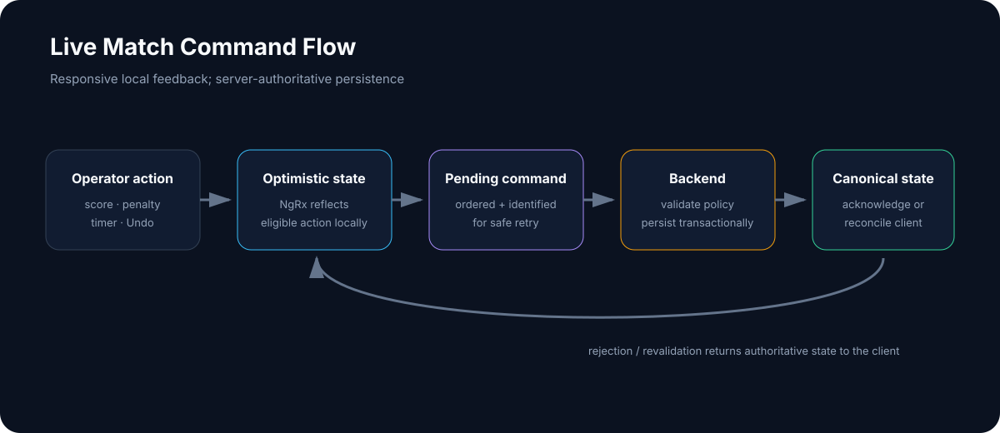
</p>

📖 *اقرأ دراسة الحالة الكاملة: [محرك حالة المباريات المباشرة والواجهة التفاؤلية](./docs/case-studies/LIVE_MATCH_ENGINE.md)*

---

### 2. خط معالجة التحليلات الرياضية غير المتزامن وطابور المهام
يحتاج المدرب إلى مؤشرات فنية دقيقة: مدى فعالية الضربات (كيزامي-زوكي، جياكو-زوكي، أورا-ماواشي-جيري)، نسبة استثمار أفضلية النقطة الأولى (سينشو Senshu)، ومعدل الأخطاء وتوزيع اللياقة على مدار فترات المباراة.

- **معمارية المعالجة المنفصلة**: بدلاً من حساب المعادلات المعقدة أثناء استجابة طلبات HTTP المباشرة، تقوم نهاية المباراة بإدراج مهمة معالجة في جدول مخصص (`analytics_tasks`).
- **قفل الصفوف في PostgreSQL**: يقوم المعالج باستدعاء المهام عبر أمر `SELECT ... FOR UPDATE SKIP LOCKED`، مما يوفر طابور مهام موزعاً بدون الحاجة إلى خادم Redis منفصل ويمنع تعارض العمليات.
- **عمليات حفظ حتمية (Idempotent Upserts)**: تعمل المهام داخل معاملات قاعدة بيانات محكمة (`BEGIN ... COMMIT`) لتحديث الجداول المجمعة `athlete_analytics_cache` و `match_analytics_cache`. إعادة تشغيل المهمة لأي مباراة ينتج نفس البيانات بدقة ودون أي تكرار.

<p align="center">
  
</p>

📖 *اقرأ دراسة الحالة الكاملة: [خط معالجة التحليلات وطابور المهام في PostgreSQL](./docs/case-studies/ANALYTICS_PIPELINE.md)*

---

### 3. نظام تصميم ثنائي الاتجاه (عربي RTL / إنجليزي LTR) عالي الكفاءة
تعتبر رياضة الكاراتيه رياضة عالمية تحظى بشعبية طاغية في العالم العربي وعلى المستوى الدولي. يوفر تطبيق جاهز تجربة مستخدم أصلية تدعم التوجيه الكامل للغتين العربية والإنجليزية.

- **خصائص CSS المنطقية**: تم بناء جميع التخطيطات باستخدام خصائص CSS المنطقية المعيارية (`margin-inline` و `padding-inline` بدلاً من left/right)، مما يتيح التبديل الفوري لاتجاه التطبيق دون إعادة بناء شجرة DOM.
- **رموز التصميم المشبعة (HSL Design Tokens)**: نظام ألوان متكامل في `variables.scss` يعتمد على متغيرات HSL لضبط الشفافية والتباين العالي بما يتوافق مع معايير الوصول العالمية.
- **تنسيق الأرقام المحلية**: تم بناء أنبوب تحويل مخصص (`ArabicNumbersPipe`) يعرض جميع المؤقتات ونقاط المباريات وجداول البطولات بالأرقام العربية المشرقية عند اختيار اللغة العربية، دون المساس بالقيم الرقمية الخام في الحالة.

<p align="center">
  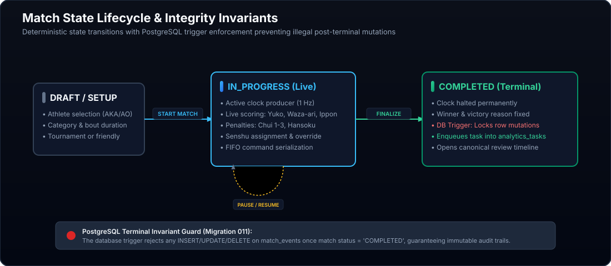
</p>

📖 *اقرأ دراسة الحالة الكاملة: [معمارية تطبيقات الهاتف ونظام التصميم ثنائي الاتجاه](./docs/case-studies/MOBILE_ENGINEERING.md)*

---

### 4. موثوقية الأنظمة الإنتاجية وخطوط النشر الآلي المستمر
تم تطبيق أعلى معايير الجودة والاستقرار في كل خطوة، من الحفظ البرمجي وحتى النشر على المتاجر:

- **خط النشر الآلي بست مراحل في GitLab CI/CD**: التحقق من الأنواع والتنسيق ➔ بناء النسخ الإنتاجية المجمعة ➔ النشر في بيئة الفحص المبدئي (Staging) ➔ اختبارات الدخان الآلية ➔ بوابة الموافقة النهائية للإنتاج ➔ النشر المباشر السلس مع إمكانية التراجع الفوري (Zero-downtime with rollback).
- **أتمتة متاجر التطبيقات**: يتولى Codemagic بناء تطبيق iOS وإدارته وتوقيعه رقمياً ونشره على TestFlight، بينما يقوم Fastlane بأتمتة حزم الأندرويد (AAB) ورفعها لمسارات Google Play.
- **سلامة قاعدة البيانات**: 37 ترحيلاً متسلسلاً للـ SQL تفرض فهارس جزئية محكمة، وحذفاً آمناً للسجلات (Soft Deletes)، وتدويراً آمناً لرموز المصادقة.

<p align="center">
  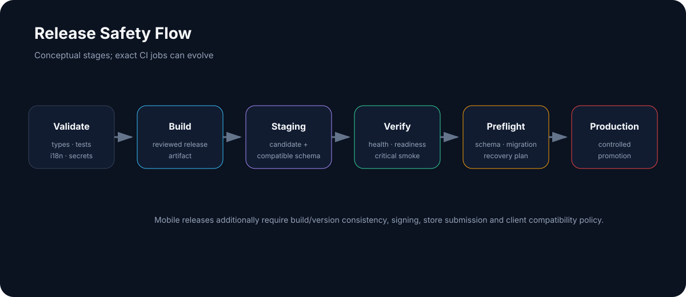
</p>

📖 *اقرأ دراسة الحالة الكاملة: [موثوقية النظام، المعاملات البنكية، والتعافي من الأخطاء](./docs/case-studies/RELIABILITY.md)*

---

## 📸 معرض الشاشات المعتمدة

تم التقاط هذه الصور مباشرة من تطبيق الهاتف الفعلي المبني بأحدث كود إنتاجي باستخدام بيانات افتراضية تجريبية:

<table>
  <tr>
    <td width="50%">
      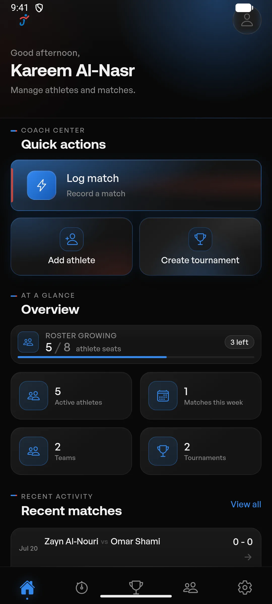<br />
      <strong>مركز تحكم المدرب</strong><br />
      بدء سريع لتسجيل المباريات، متابعة جاهزية الفريق، وجداول البطولات القادمة.
    </td>
    <td width="50%">
      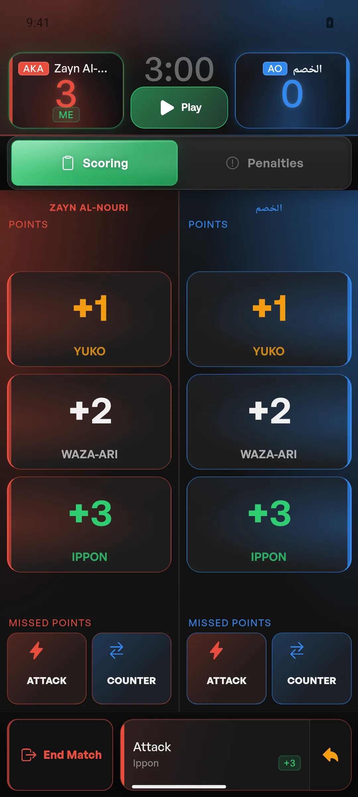<br />
      <strong>تسجيل أحداث المباراة المباشرة (أكا ضد أو)</strong><br />
      أزرار تسجيل النقاط في أجزاء من الثانية، تصنيف الضربات، واحتساب الإنذارات.
    </td>
  </tr>
  <tr>
    <td width="50%">
      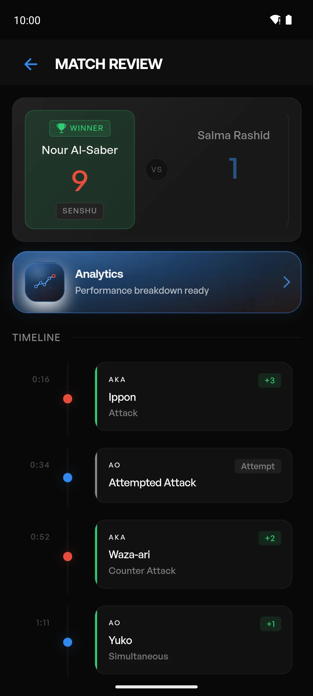<br />
      <strong>سجل زمني مفصل للمباراة</strong><br />
      شريط زمني يوثق كل نقطة وإنذار، وأفضلية السينشو، مع دعم كامل لخاصية التراجع.
    </td>
    <td width="50%">
      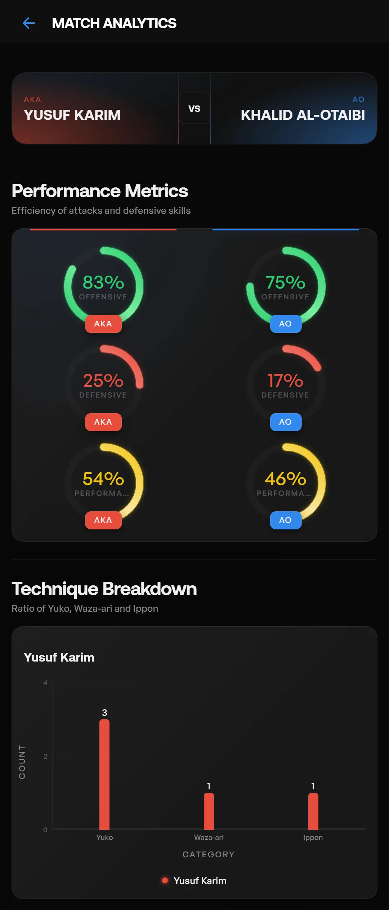<br />
      <strong>عرض التحليلات الفنية للأداء</strong><br />
      مخططات رادارية للهجوم والدفاع، فاعلية الضربات حسب النوع، وتوزيع الإنذارات.
    </td>
  </tr>
  <tr>
    <td width="50%">
      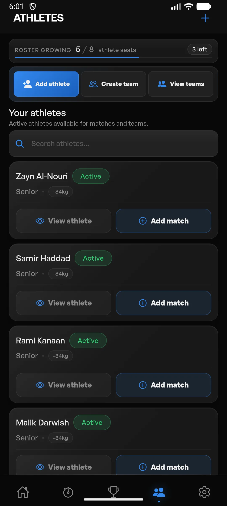<br />
      <strong>إدارة قوائم وأفواج اللاعبين</strong><br />
      متابعة أوزان اللاعبين، الفئات العمرية، وحالة الجاهزية الفنية للبطولات.
    </td>
    <td width="50%">
      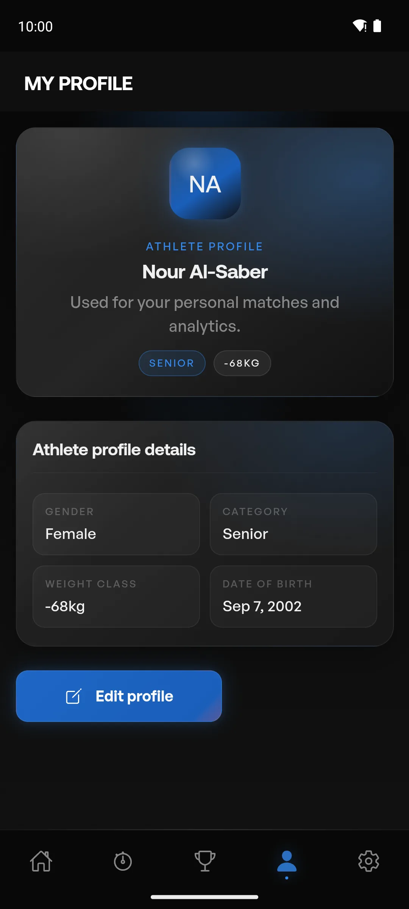<br />
      <strong>الملف التفصيلي للاعب</strong><br />
      السجل التاريخي للاعب، إجمالي الميداليات، والسمات الفنية المسجلة.
    </td>
  </tr>
  <tr>
    <td width="50%">
      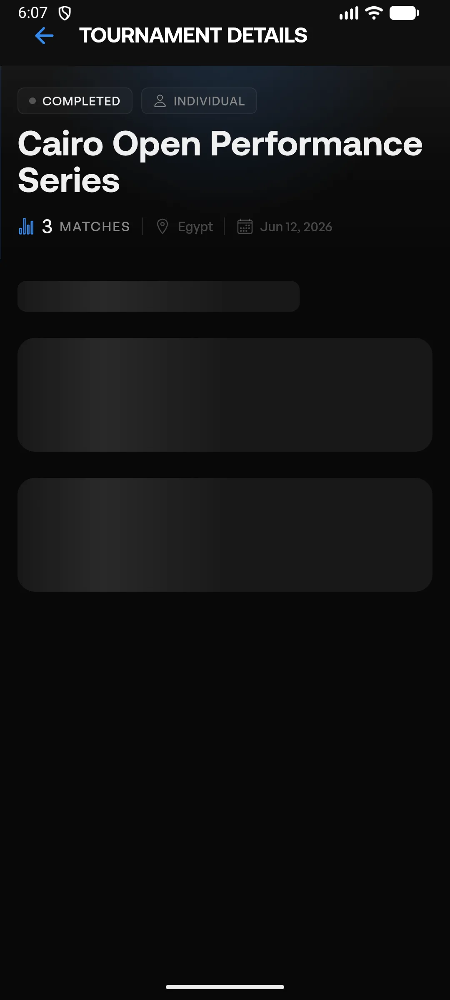<br />
      <strong>إدارة وتوثيق البطولات</strong><br />
      أدوار خروج المغلوب، توجيه المباريات، وإصدار تقارير البطولة المجمعة.
    </td>
    <td width="50%">
      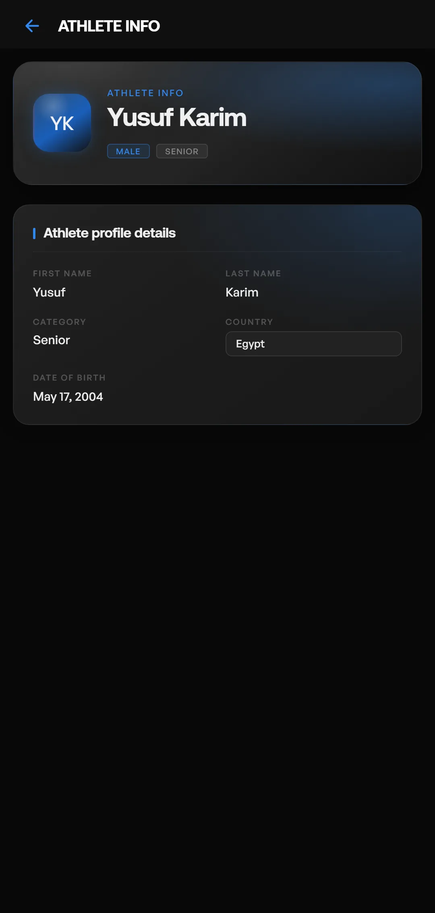<br />
      <strong>شاشة الخدمة الذاتية للاعب</strong><br />
      ملخص أداء اللاعب الشخصي، المباريات القادمة، ومسار تطور الضربات والنقاط.
    </td>
  </tr>
</table>

📖 *تصفح معرض الشاشات الكامل (64 شاشة): [معرض شاشات المنتج](./docs/PRODUCT_SCREEN_GALLERY.md) و [فهرس لقطات الشاشة](./docs/SCREENSHOT_INDEX.md)*

---

## 🧪 هرم الاختبارات ومقاييس الجودة

يحظى الكود الإنتاجي بتغطية واسعة من خلال **390 ملف اختبار آلي**، تضمن منع أي انكسار برمجي عبر مسارات المستخدم الحيوية:

```
                 /\
                /  \      15 سيناريو فحص شامل ومسار كامل (Playwright)
               /----\     - مسار المباراة، دورة حياة المصادقة، الطابور المحلي
              /      \
             /--------\   156 اختبار تكامل وواجهات برمجية (Supertest + Jest)
            /          \  - عقود الخدمات، معاملات قاعدة البيانات، طابور المعالج
           /------------\
          /              \ 219 اختبار وحدة ومخازن حالة (Jasmine + Karma + NgRx)
         /----------------\ - محولات الحالة، التأثيرات، الفلاتر، ومطابقة الأرقام
```

| تصنيف الاختبارات | النطاق والتقنيات المستخدمة | أهم القواعد التي يتم التحقق منها |
| :--- | :--- | :--- |
| **اختبارات الواجهة والحالة** | 219 ملفاً (`client/src/app/**/*.spec.ts`) | انتقالات الحالة، الإرسال التفاؤلي، حفظ النتائج المؤقتة، وتحويل الأرقام. |
| **اختبارات تكامل الخادم** | 156 ملفاً (`server/src/**/*.test.ts`) | التراجع عن المعاملات عند الخطأ، قيود الفهارس الفريدة، وتشغيل طابور المهام. |
| **اختبارات الهاتف والمسار الكامل** | 15 حزمة اختبارات (Playwright ومحاكيات أصلية) | دورة حياة تشغيل التطبيق، حفظ الأحداث عند انقطاع الاتصال، وتوافق العرض العربي. |

📖 *اقرأ التفاصيل الكاملة للاختبارات: [استراتيجية الاختبارات وضمان الجودة البرمجية](./docs/TESTING_AND_QUALITY.md)*

---

## 📐 نموذج البيانات العلائقي

تم بناء مخطط قاعدة البيانات على معايير صارمة في تكامل البيانات وقابلية التدقيق:

<p align="center">
  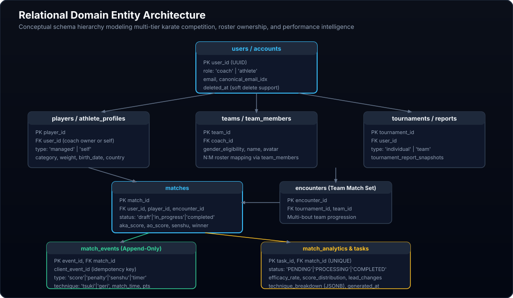
</p>

---

## 📑 سجلات القرارات المعمارية (ADRs)

| الرقم | عنوان القرار المعماري | ملخص القرار المتخذ | المبررات والمفاضلة التقنية |
| :--- | :--- | :--- | :--- |
| **ADR-001** | **المستودع الموحد (Monorepo)** | هيكلة أحادية بمساحات عمل npm (`client` و `server` و `shared`). | مطابقة تامة لنماذج TypeScript بين الخادم والواجهة وقت الترجمة. |
| **ADR-002** | **آلة حالة NgRx** | الاعتماد على مخزن حالة موحد بدلاً من حالة المكونات المحلية. | ضمان إمكانية التراجع الحتمي وإعادة تشغيل الأحداث واستقرار الواجهة. |
| **ADR-003** | **طابور مهام PostgreSQL** | استخدام `FOR UPDATE SKIP LOCKED` بدلاً من Redis. | إلغاء أخطاء المعاملات الموزعة؛ حفظ المهام ذرياً مع بيانات المباراة. |
| **ADR-004** | **مكونات Angular Standalone** | الانتقال الكامل للمكونات المستقلة وإلغاء NgModules. | تقليل حجم حزم التحميل وتسهيل هيكلية شجرة المكونات وسرعة الترجمة. |
| **ADR-005** | **نمط وحدات Node.js ESM** | تطبيق معيار ECMAScript الصارم مع امتدادات `.js` الصريحة. | بيئة تشغيل قياسية متوافقة مع المستقبل وتنسجم تماماً مع كود الواجهة. |
| **ADR-006** | **نظام تصميم CSS المنطقي** | استخدام متغيرات HSL مع خصائص CSS Logical Properties. | تحويل فوري لاتجاه التطبيق (LTR/RTL) بدون تكرار ملفات التنسيق. |
| **ADR-007** | **ترحيلات SQL المتسلسلة** | استخدام ملفات SQL رقمية صريحة بدون أطر ORM معقدة. | رؤية كاملة لخطط التنفيذ والفهارس والأقفال وتجنب بطء الاستعلامات. |
| **ADR-008** | **النشر المزدوج الآلي** | خط GitLab للويب والخادم، Codemagic للـ iOS، و Fastlane للأندرويد. | مسارات نشر متخصصة تلائم متطلبات التوقيع الرقمي الصارمة للمتاجر. |

📖 *اقرأ جميع القرارات الهندسية: [سجلات القرارات المعمارية الهندسية](./docs/ENGINEERING_DECISIONS.md)*

---

## 📚 دراسات الحالة الهندسية والتوثيق المتخصص

| الوثيقة الهندسية | الجمهور المستهدف | المحتوى والتركيز الفني |
| :--- | :--- | :--- |
| 📘 [**نظرة هندسية عامة**](./docs/ENGINEERING_OVERVIEW.md) | مسؤولو التوظيف / مدراء الهندسة | نطاق النظام، الحجم، المكدس التقني، والقيمة التقنية المضافة. |
| 🏛️ [**معمارية النظام الشاملة**](./docs/ARCHITECTURE.md) | مهندسو المعمارية / كبار المهندسين | هيكل المستودع، مسارات البيانات، بروتوكولات الاتصال، وتصميم الوحدات. |
| 📑 [**سجلات القرارات المعمارية (ADRs)**](./docs/ENGINEERING_DECISIONS.md) | قادة الفرق / مهندسو النظم | 8 قرارات معمارية موثقة بالسياق والبدائل المدروسة والمفاضلات. |
| 🧪 [**الاختبارات وضمان الجودة**](./docs/TESTING_AND_QUALITY.md) | قادة الجودة / مهندسو الاختبار (SDET) | تفصيل 390 ملف اختبار، هرم الاختبارات، وبوابات الفحص الآلي. |
| 🚀 [**هندسة النشر والعمليات (DevOps)**](./docs/RELEASE_ENGINEERING.md) | مهندسو البنية التحتية والعمليات | مراحل GitLab CI/CD، بناء Codemagic، حزم Fastlane، وإجراءات التراجع. |
| 🔒 [**الخصوصية وأمان البيانات**](./docs/PRIVACY_AND_DATA_SAFETY.md) | مدققو الأمان ومسؤولو الامتثال | سياسة إخفاء البيانات السرية، ضمان خلو المستودع من أي PII، والتأمين. |
| ⚡ [**دراسة حالة: محرك المباريات المباشرة**](./docs/case-studies/LIVE_MATCH_ENGINE.md) | كبار مهندسي الواجهات والتطبيقات | التحديثات التفاؤلية، معالجة انزياح التخطيط (0 CLS)، وطابور التراجع. |
| 📈 [**دراسة حالة: خط معالجة التحليلات**](./docs/case-studies/ANALYTICS_PIPELINE.md) | كبار مهندسي الخلفية والبيانات | طابور PostgreSQL (`SKIP LOCKED`)، التجميع الحتمي، والتخزين المؤقت. |
| 📱 [**دراسة حالة: هندسة تطبيقات الهاتف**](./docs/case-studies/MOBILE_ENGINEERING.md) | مهندسو الهاتف وواجهات الاستخدام | جسور Capacitor 7، سمات Ionic 8، ودعم الاتجاهين العربي والإنجليزي. |
| 🛡️ [**دراسة حالة: موثوقية واستقرار النظام**](./docs/case-studies/RELIABILITY.md) | مهندسو الموثوقية (SRE) | إدارة اتصالات قاعدة البيانات، المعاملات متعددة المراحل، والتعافي من الأخطاء. |
| 📱 [**حصر شاشات التطبيق والحالات**](./docs/APP_VIEW_INVENTORY.md) | مهندسو الجودة والمنتج | مصفوفة 64 شاشة وحالة مسجلة حسب المسار والصلاحيات والالتقاط. |
| 📸 [**معرض شاشات المنتج المعماري**](./docs/PRODUCT_SCREEN_GALLERY.md) | مسؤولو التوظيف والمصممون | جولة بصرية منتقاة مصحوبة بتعليقات هندسية عبر 6 محاور رئيسية. |
| 📂 [**فهرس لقطات الشاشة الشامل**](./docs/SCREENSHOT_INDEX.md) | مراجعو ومطورو المستودع | فهرس شامل لـ 64 لقطة شاشة مع دقة العرض والأحجام والحالات. |
| 🎬 [**سيناريو الفيديو التوضيحي**](./docs/DEMO_VIDEO_STORYBOARD.md) | منتجو الفيديو والمراجعون | توقيت المشاهد العشرة، النصوص التوضيحية، وتفاعل المستخدم. |
| 📋 [**بيان سلامة وتكامل الأصول**](./docs/ASSET_MANIFEST.md) | مسؤولو الامتثال والأمان | تتبع كامل للأصول والبيانات التجريبية الآمنة وسجل التحسين. |

---

## 👨‍💻 المهندس المعماري والمؤلف

تم تصميم وبناء وهندسة واختبار ونشر **منصة جاهز (Jahiz Analytics)** بالكامل بواسطة:

### **شوقي السيد (Shawky Elsayed)**
*Senior Software Engineer & Full-Stack Systems Architect*

- **مؤلف المستودع البرمجي**: **أكثر من 735 حفظ برمجي (Git Commit)** كمهندس وحيد على مدار تاريخ المشروع.
- **المهارات الأساسية**: تطوير النظم الشاملة بـ TypeScript، أطر عمل Angular و NgRx، تطبيقات الهواتف عبر Ionic و Capacitor، خوادم Node.js ESM، قواعد بيانات PostgreSQL، أنظمة العمليات والنشر المستمر CI/CD، وإدارة متاجر التطبيقات.
- **حساب GitHub**: [@shawky2002020](https://github.com/shawky2002020)
- **الملف المهني LinkedIn**: [Shawky Elsayed](https://www.linkedin.com/in/shawky2002020/)
- **الموقع الشخصي**: [shawky.dev](https://shawky2002020.github.io/)

---

## ⚖️ إشعار الملكية الفكرية وحقوق الاستخدام

هذا المستودع يمثل **معرضاً هندسياً ودراسة حالة معمارية عامة**. كود المصدر الفعلي للتطبيق الإنتاجي، وقواعد البيانات الخاصة، والخدمات السحابية تظل ملكية خاصة وغير مرخصة لإعادة الاستخدام التجاري. راجع ملفات [NOTICE.md](./NOTICE.md) و [SECURITY.md](./SECURITY.md).

جميع الحقوق محفوظة © 2026 شوقي السيد / جاهز للتحليلات (Jahiz Analytics).
