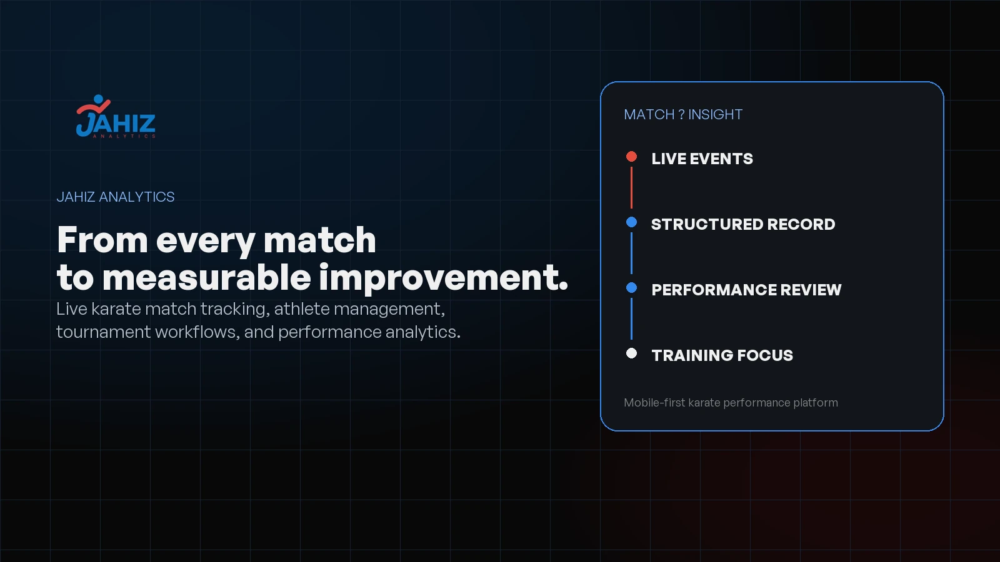
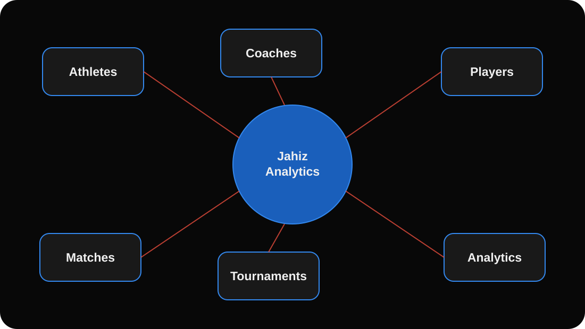
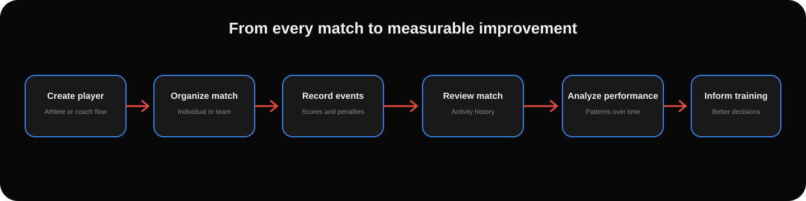

[English](./README.md) | [العربية](./README.ar.md)

  

<h1 align="center">Jahiz Analytics — جاهز</h1>

<strong>From every match to measurable improvement.</strong> 
A mobile-first karate performance platform for live match tracking, athlete development, tournament workflows, and actionable analytics.

Android: <strong>Closed testing</strong> · iOS: <strong>TestFlight beta</strong> · Public stores: <strong>Coming soon</strong>

## What is Jahiz Analytics?

Jahiz Analytics helps karate coaches and athletes turn match activity into structured, reviewable performance information. It brings live logging, athlete and player management, tournaments, and analytics into one mobile-first product.

## The problem

Coaching observations often live in memory, loose notes, or disconnected files. That makes patterns hard to compare across matches, slows down feedback, and fragments player and tournament context. During competition, recording must stay fast and focused.

## The solution

Jahiz connects **match recording → structured data → performance analytics → better training decisions**. It supports quick capture of scoring and penalties, then turns completed activity into a reviewable match record and verified analytics views.

## Product experience

Publication-ready native screenshots are intentionally withheld from this local draft while a fresh demo-only Android capture set is completed. This repository does not use browser captures, recreated product UI, or screenshots with unverified identities. The planned set will cover home, live match logging, event history, match analytics, player profile, team management, tournaments, and performance overview—only where each screen is safely captured from the installed app.

## Live match tracking

Record karate scoring and penalty events with match timer support, then review the match activity history. The product is designed for focused interaction during live competition and a clear review flow after completion.

## Performance analytics

Where verified in the current app, performance views help coaches and athletes review scoring patterns, technique distribution, activity timelines, and comparisons across recorded match activity. Analytics are presented as decision support, not as invented ratings or guarantees.

## Athletes, players, teams, and tournaments

Athletes can manage their own profile and match history; coaches can work with managed players and teams where those flows are enabled. Jahiz supports individual tournament workflows and coach team-tournament workflows where verified. This showcase deliberately does not disclose internal authorization rules.

## How it works

## Engineering highlights

Jahiz Analytics is a cross-platform mobile product built with a TypeScript-based stack: Angular, Ionic, Capacitor, Node.js, Express, PostgreSQL, RxJS, and chart-driven analytics presentation. Its design emphasizes structured feature boundaries, mobile-first responsive UX, consistent design tokens, and backend-controlled business rules.

See the recruiter-focused [engineering case study](./docs/ENGINEERING_CASE_STUDY.md) and the high-level [platform overview](./assets/diagrams/platform-overview.svg).

## Product principles

- Fast interaction during live matches.
- Clear match state and reviewable activity history.
- Role-aware coach and athlete product experiences.
- Accessible performance information on mobile screens.
- Privacy-conscious demo and showcase material.
- Progressive delivery of advanced analytics.

## Current status

| Area | Status |
| --- | --- |
| Mobile experience | Active development / beta |
| Live match logging | Available |
| Match review and event history | Available |
| Performance analytics | Available where verified in the current app |
| Player and athlete profiles | Available |
| Coach team management | Available where verified |
| Individual tournaments | Available |
| Team tournaments | Available for coaches where verified |
| Android release | Closed testing |
| iOS release | TestFlight beta |
| Google Play / App Store | Coming soon |
| Exports, AI, and video analysis | Roadmap |

## Roadmap

**Available now:** profile management, live logging, scoring and penalty tracking, match review, verified analytics, and verified tournament workflows.

**In progress:** cross-platform beta refinement and release preparation.

**Future direction:** public Android and iOS store release, PDF/report exports, AI-generated insights, video analysis, coach-athlete invitations, organization and academy accounts, federation/official organizer mode, public marketplace, advanced sharing and permissions, and full payment, subscription, and quota enforcement.

## App availability

<!-- Replace with official store URL after public release -->

<!-- Replace with official store URL after public release -->

## Privacy and ownership

This repository contains demonstration-only material. No user data is stored here; screenshots, when added, will use sanitized fictional fixtures only. Production source code, infrastructure, and private services remain private. Read the [privacy and data-safety note](./docs/PRIVACY_AND_DATA_SAFETY.md).

Jahiz Analytics is an independent sports-technology product developed to modernize karate performance tracking and match analysis. Featured work includes product architecture, cross-platform application engineering, mobile UI/UX, match workflows, analytics presentation, and release preparation.

## Contact

GitHub: [@shawky2002020](https://github.com/shawky2002020)

## Repository notes

This is a showcase and case-study repository, not the production application. See [NOTICE.md](./NOTICE.md) and [SECURITY.md](./SECURITY.md).
