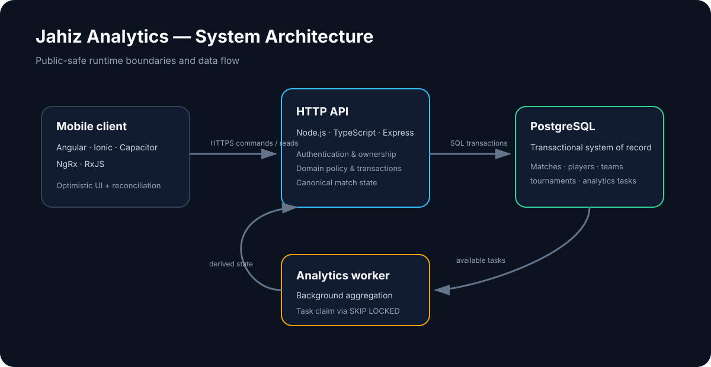

# System architecture



## Runtime boundaries

Jahiz is implemented as a TypeScript product with four important runtime boundaries:

1. **Mobile client** — Angular/Ionic application packaged for iOS and Android through Capacitor.
2. **HTTP API** — Node.js/Express service that authenticates requests, applies account/ownership policy and executes domain operations.
3. **Background worker** — processes analytics work independently from interactive API requests.
4. **PostgreSQL** — transactional source of record for accounts, players, matches, tournaments and derived analytics state.

Exact framework, runtime and database versions are implementation details that change over time; the README and architecture docs use durable technology names unless a version itself is part of a compatibility decision.

## Client state flow

```text
Operator action
    │
    ▼
NgRx action / optimistic local state
    │
    ▼
Ordered pending command
    │
    ▼
API request
    │
    ▼
Backend validation + transaction
    │
    ▼
Canonical server state
    │
    ▼
Client acknowledgement / reconciliation
```

The local optimistic path exists for responsiveness. It is not the final authority: the backend validates ownership, match lifecycle and domain rules before persistence.

Mobile lifecycle handling is also part of the state design. Foreground/resume or recovered connectivity should revalidate server state without blindly recreating an active match session or discarding pending local intent.

## Backend boundaries

The API follows explicit controller/service/repository-style boundaries where useful:

```text
HTTP request → controller → policy/domain service → repository → PostgreSQL
```

Key concerns include:

- authentication and session lifecycle;
- account capability and owner-scoped access;
- player/team/tournament ownership;
- match lifecycle and event persistence;
- analytics task creation and retrieval;
- mobile client version policy.

Commercial plan/usage decisions are intentionally separate from base account capability. The backend—not hidden UI—is responsible for enforcing access rules.

## Transactional persistence

Operations that update several related pieces of state are wrapped in database transactions. Typical examples include recording a match event, recomputing related score state, updating match summaries, and creating follow-up work.

Important design goals:

- no partial multi-step writes;
- idempotent handling for retryable client commands;
- history preservation where analytics/review depend on past records;
- owner-scoped queries and constraints;
- schema changes designed for compatibility during rollout.

## Analytics worker

Analytics generation can be handled outside the request path:

```text
Match/domain change
      │
      ▼
analytics task row
      │
      ▼
worker claims task with FOR UPDATE SKIP LOCKED
      │
      ▼
calculate / persist derived analytics
      │
      ▼
client reads canonical result through API
```

`FOR UPDATE SKIP LOCKED` lets multiple workers claim different available rows without requiring a separate message broker. The tradeoff is that task coordination consumes PostgreSQL connections and requires retry/stale-task handling.

## Product capability boundary

Current product guidance distinguishes account capabilities from future commercial entitlements. Coach-only team workflows cannot be unlocked simply by changing an athlete plan. Future billing, quota enforcement, AI/video features and collaboration are separate concerns.

See [Engineering decisions](./ENGINEERING_DECISIONS.md) and [Feature claim verification](./FEATURE_CLAIM_VERIFICATION.md).
