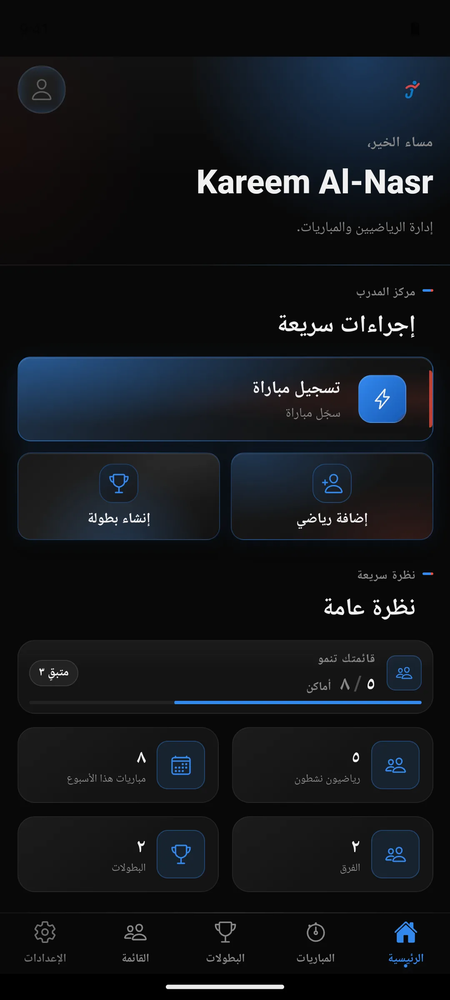
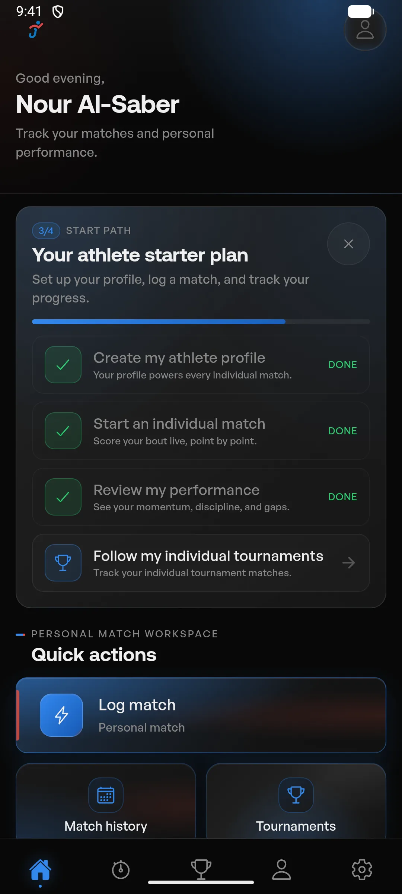
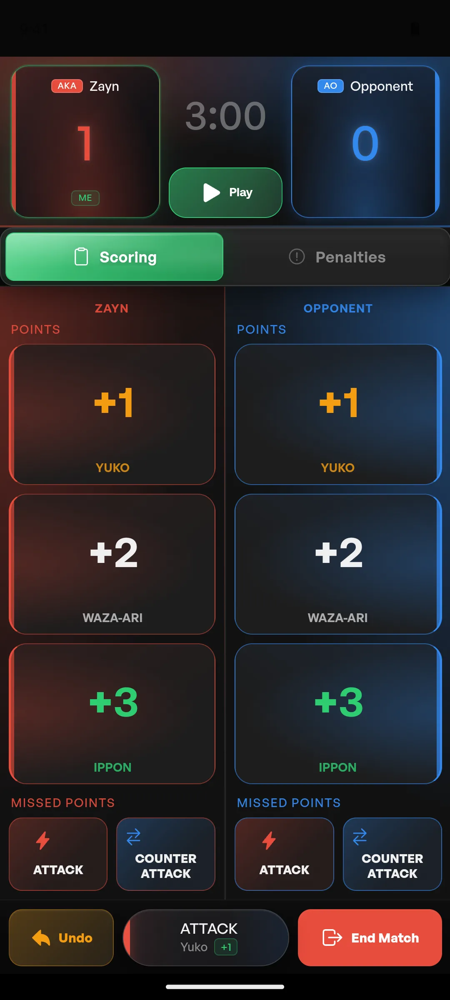
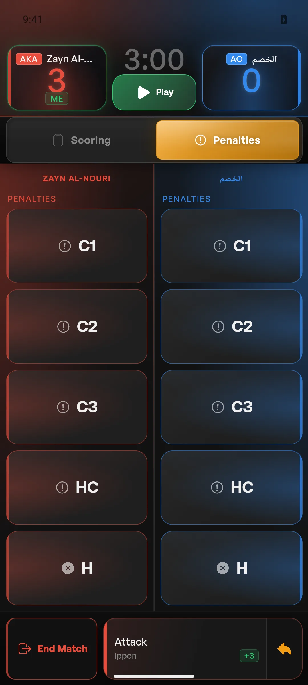
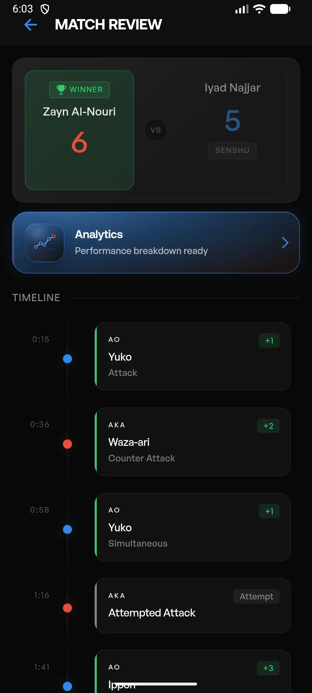
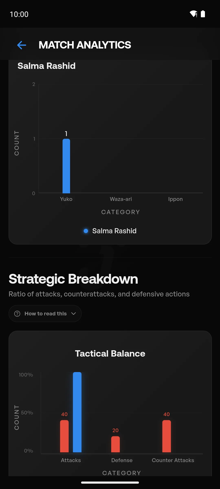
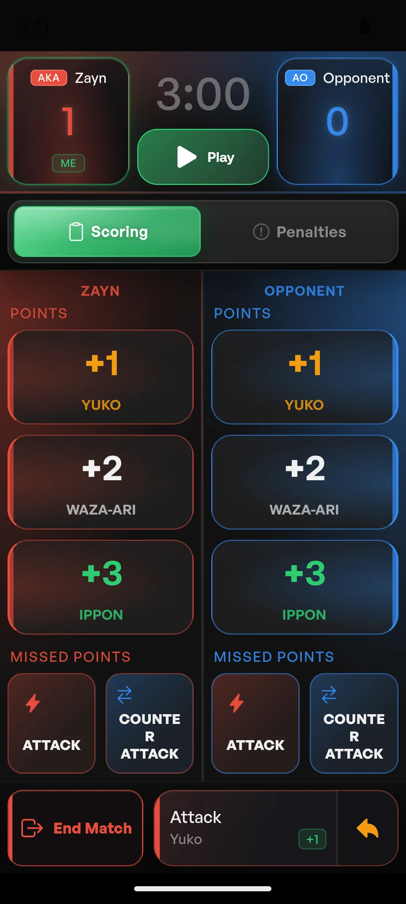
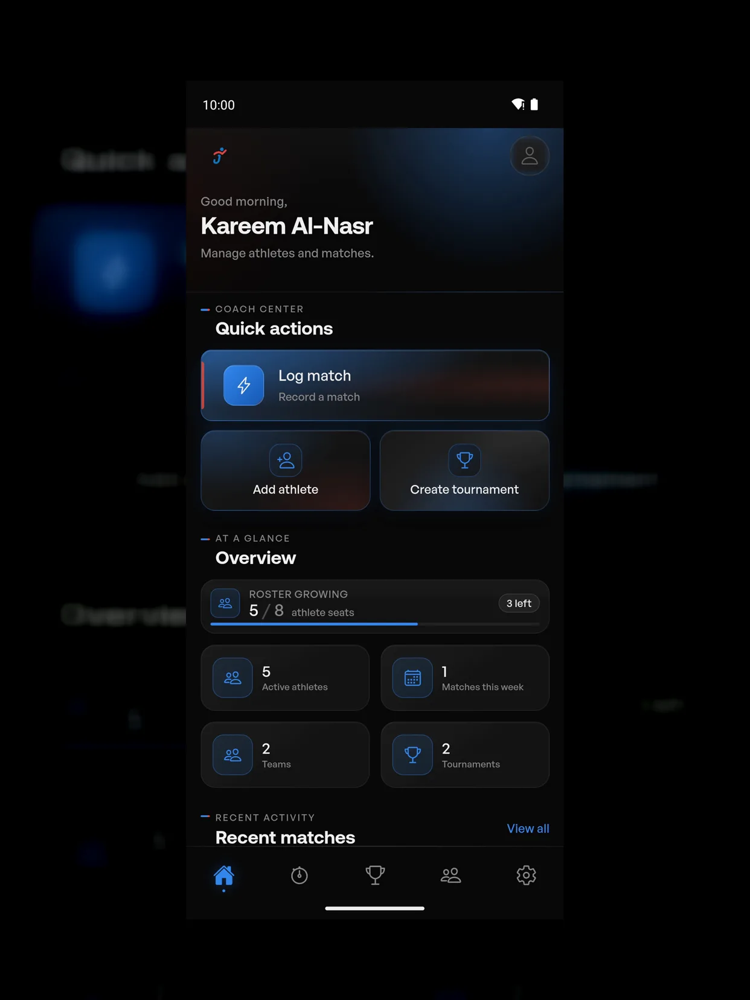

# Jahiz Analytics: Product Screen Gallery & Architectural Walkthrough

> Curated visual walkthrough of the production mobile application, accompanied by technical commentary on component architecture, state management, and domain constraints.

---

## 1. Coach Command Center & Athlete Dashboards

<table>
  <tr>
    <td width="50%">
       
      <strong>Coach Command Center (English LTR)</strong> 
      <em>Architecture</em>: `HomePage` acts as an operational hub, aggregating active squads, athlete readiness badges, and upcoming tournament fixtures via memoized NgRx selectors. Sub-millisecond navigation eliminates route transition lag.
    </td>
    <td width="50%">
       
      <strong>Coach Command Center (Arabic RTL)</strong> 
      <em>Architecture</em>: Full bi-directional mirroring via CSS Logical Properties (`margin-inline`, `padding-inline`). Custom `ArabicNumbersPipe` transforms all metrics to Eastern Arabic numerals without altering raw numeric state.
    </td>
  </tr>
  <tr>
    <td width="50%">
       
      <strong>Athlete Self-Service Home</strong> 
      <em>Architecture</em>: `AthleteSelfProfileGuard` dynamically routes authenticated athletes to their scoped personal feed, displaying historical win rates, personal technique scores, and upcoming individual bouts.
    </td>
    <td width="50%">
       
      <strong>Managed Athlete Technical Profile</strong> 
      <em>Architecture</em>: Relational profile view loading historical performance metrics from `athlete_analytics_cache`. Soft-delete recovery supported via partial unique indexing.
    </td>
  </tr>
</table>

---

## 2. Live Match State Machine & Scorer Engine

<table>
  <tr>
    <td width="50%">
       
      <strong>Active Live Match Timer (02:48)</strong> 
      <em>Architecture</em>: Zero-CLS timer display. Ticking clock decoupled from UI render tree, eliminating unnecessary layout recalculations (benchmarked from 146 reflows to 2 reflows per 2 ticks).
    </td>
    <td width="50%">
       
      <strong>Live Scoring Event (+2 Waza-ari)</strong> 
      <em>Architecture</em>: Sub-millisecond optimistic action dispatch. The score updates locally on tap and places an event payload in a local FIFO queue dispatched to `POST /api/v1/matches/:id/events`.
    </td>
  </tr>
  <tr>
    <td width="50%">
       
      <strong>Penalties Management (C1 / C2 Warnings)</strong> 
      <em>Architecture</em>: Dual-category WKF penalty machine enforcing discrete progression (Chukoku ➔ Keikoku ➔ Hansoku-Chui ➔ Hansoku Disqualification) with instant visual indicators for both competitors.
    </td>
    <td width="50%">
       
      <strong>Arabic Live Scorer Parity (RTL)</strong> 
      <em>Architecture</em>: Mirrored Aka (Red) and Ao (Blue) competition sides with zero layout shift (0 CLS) and localized match timer formatting.
    </td>
  </tr>
</table>

---

## 3. Match Review & Chronological Event History

<table>
  <tr>
    <td width="50%">
       
      <strong>Completed Match Result & Senshu Status</strong> 
      <em>Architecture</em>: `MatchReviewSummaryComponent` renders the final scoreline, first-score advantage (Senshu), and foul totals. Transitioning to review locks match mutations on the backend.
    </td>
    <td width="50%">
       
      <strong>Chronological Activity Timeline</strong> 
      <em>Architecture</em>: Immutable event stream visualizing points, penalties, and technique tags at exact second-by-second timestamps. Supports deterministic audit and tactical debriefs.
    </td>
  </tr>
</table>

---

## 4. Multi-Dimensional Performance Analytics

<table>
  <tr>
    <td width="50%">
       
      <strong>Tactical Radar: Offense vs. Defense</strong> 
      <em>Architecture</em>: Chart.js rendering aggregated attack efficacy, Senshu conversion rate, and defensive block efficiency. Computed asynchronously by the PostgreSQL worker queue.
    </td>
    <td width="50%">
       
      <strong>Technique-Level Scoring Breakdown</strong> 
      <em>Architecture</em>: Frequency and success rate analysis across Kizami-Zuki, Gyaku-Zuki, Ura-Mawashi-Geri, and sweep techniques, enabling data-informed sparring adjustments.
    </td>
  </tr>
</table>

---

## 5. Squad Roster & Tournament Management

<table>
  <tr>
    <td width="50%">
       
      <strong>Team Roster & Squad Readiness</strong> 
      <em>Architecture</em>: Squad membership tracking weight categories (-60kg, -67kg, -75kg, -84kg, +84kg) and competition readiness flags for coach selection workflows.
    </td>
    <td width="50%">
       
      <strong>Tournament Hub & Bout Progress</strong> 
      <em>Architecture</em>: Single-elimination bracket tracking and encounter status, automatically compiling match outcomes into cumulative tournament reports.
    </td>
  </tr>
</table>

---

## 6. Device Responsiveness & Tablet Layouts

<table>
  <tr>
    <td width="50%">
       
      <strong>Ultra-Compact 320px Mobile</strong> 
      <em>Architecture</em>: Responsive flex/grid architecture guaranteeing 0 horizontal overflow and touch targets exceeding Apple/Google minimums (44px) on compact hardware.
    </td>
    <td width="50%">
       
      <strong>Tablet Optimization (iPad Pro 13")</strong> 
      <em>Architecture</em>: Adaptive multi-column grid layout expanding squad readiness and match history panels for mat-side tournament monitoring.
    </td>
  </tr>
</table>
