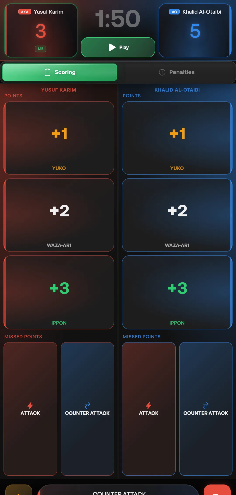
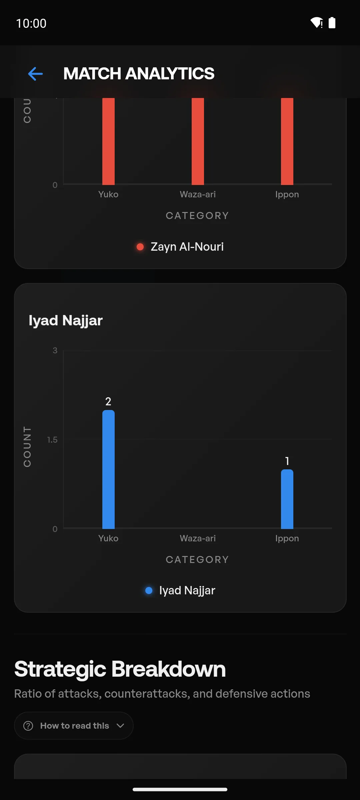
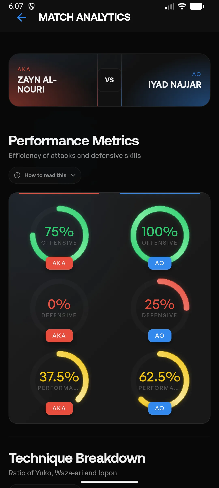
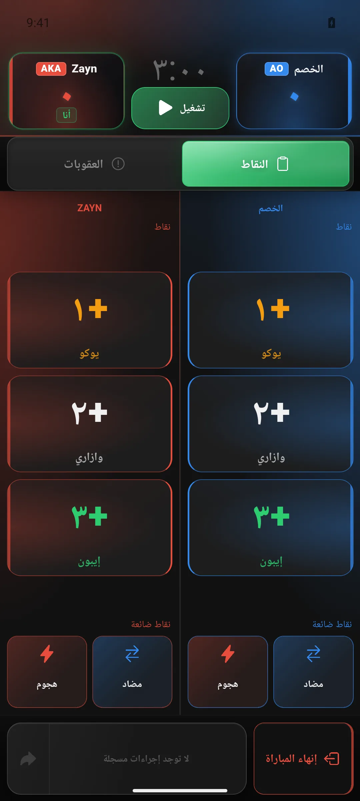
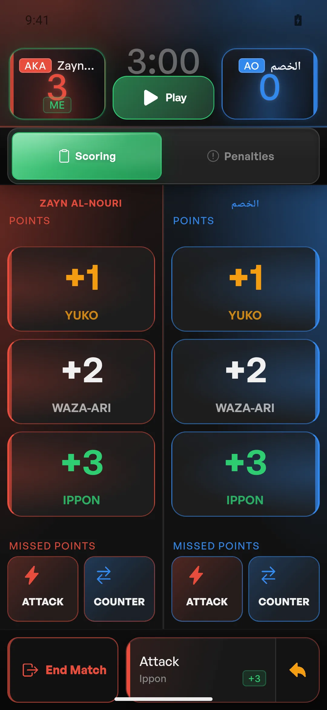

# Product screen gallery

This gallery is the extended visual companion to the recruiter-focused README. Screens are sanitized captures of the application using non-production data. The main README intentionally shows fewer images so the product story stays scannable.

## Core product flow

<table>
  <tr>
    <td width="50%"> <strong>Coach home</strong> Entry point for athletes, matches, teams and tournaments.</td>
    <td width="50%"> <strong>Match setup</strong> Creates the match context before live logging begins.</td>
  </tr>
  <tr>
    <td width="50%"> <strong>Live match</strong> Score, timer and match actions share one operational surface.</td>
    <td width="50%"> <strong>Technique context</strong> Structured match input supports later review and analytics.</td>
  </tr>
  <tr>
    <td width="50%"> <strong>Review timeline</strong> Recorded events remain inspectable after the match.</td>
    <td width="50%"> <strong>Match analytics</strong> Derived views turn recorded activity into performance context.</td>
  </tr>
</table>

## Athlete and coach workflows

<table>
  <tr>
    <td width="50%"> <strong>Managed athlete</strong> Coach-owned player records support coach workflows.</td>
    <td width="50%"> <strong>Athlete self profile</strong> Athlete accounts are scoped to their own individual experience.</td>
  </tr>
  <tr>
    <td width="50%"> <strong>Team management</strong> Team workflows are coach capabilities.</td>
    <td width="50%"> <strong>Individual tournament</strong> Tournament context connects multiple match activities.</td>
  </tr>
</table>

## Localization and mobile behavior

<table>
  <tr>
    <td width="50%"> <strong>Arabic RTL scorer</strong> Direction changes affect layout, alignment and mixed-language content—not only translated strings.</td>
    <td width="50%"> <strong>Compact mobile layout</strong> Critical actions are designed for constrained screen geometry.</td>
  </tr>
</table>

For a file-oriented inventory, see [`SCREENSHOT_INDEX.md`](./SCREENSHOT_INDEX.md). The inventory is supporting documentation, not a product-feature count.
