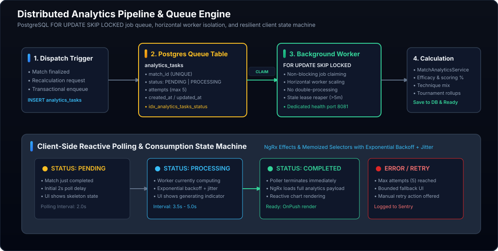

# Case Study: Distributed Analytics Queue & Worker Engine



## 1. Problem & Context

A competitive karate match generates dozens of discrete events: punches, kicks, sweeps, warnings, penalties, Senshu, timeouts, and score changes mapped to exact millisecond timestamps.

Turning this raw chronological event stream into actionable coaching intelligence requires multi-stage statistical processing:
- **Efficacy Rates**: Attacks thrown vs successful scores across lead-hand Tsuki and Geri techniques.
- **Scoring Momentum**: Rolling lead-change curves and points scored per 30-second interval.
- **Defensive Disciplines**: Penalties conceded relative to offensive intensity.
- **Historical Benchmarking**: Comparing current bout metrics against athlete career and tournament averages.

Performing these aggregations synchronously within the API request lifecycle when an operator finalizes a match causes HTTP request timeouts, blocks database connections, and creates latency spikes for other active matches.

---

## 2. Distributed Queue Architecture

```
Match Finalized ──> Enqueue analytics_tasks ──> Worker Claim (SKIP LOCKED) ──> Calculation Engine ──> DB Save
                                                                                                    │
Client Reactive Poller (Exponential Backoff + Jitter) <─────────────────────────────────────────────┘
```

### The Queue Schema (`analytics_tasks`)
Backed by PostgreSQL (Migration `002_create_analytics_tasks.sql` and hardened in `029`/`030`):
```sql
CREATE TABLE analytics_tasks (
    task_id SERIAL PRIMARY KEY,
    match_id INT NOT NULL UNIQUE REFERENCES matches(match_id) ON DELETE CASCADE,
    status VARCHAR(20) NOT NULL CHECK (status IN ('PENDING', 'PROCESSING', 'COMPLETED', 'FAILED')),
    attempts INT NOT NULL DEFAULT 0,
    last_error TEXT,
    created_at TIMESTAMP WITH TIME ZONE DEFAULT CURRENT_TIMESTAMP,
    updated_at TIMESTAMP WITH TIME ZONE DEFAULT CURRENT_TIMESTAMP,
    analytics_generated_at TIMESTAMP WITH TIME ZONE
);

CREATE INDEX idx_analytics_tasks_status ON analytics_tasks(status, created_at);
```

---

## 3. High-Concurrency Row Locking (`FOR UPDATE SKIP LOCKED`)

To allow multiple background worker processes to run concurrently across different server instances without duplicate execution, the queue engine uses PostgreSQL's row-level lock skipping:

```sql
UPDATE analytics_tasks
SET status = 'PROCESSING', updated_at = CURRENT_TIMESTAMP
WHERE task_id = (
  SELECT task_id
  FROM analytics_tasks
  WHERE status = 'PENDING'
  ORDER BY created_at ASC
  LIMIT 1
  FOR UPDATE SKIP LOCKED
)
RETURNING task_id, match_id, attempts;
```

### How It Operates:
1. The sub-select acquires an exclusive row lock on the earliest `PENDING` record.
2. `SKIP LOCKED` instructs any other concurrent worker querying at the same millisecond to immediately bypass this locked row and claim the next available task.
3. Completely prevents race conditions, row contention, and double-processing without requiring external locking infrastructure.

---

## 4. Fault Tolerance & Stale Lease Reaper

Worker crashes, unhandled calculation exceptions, or container restarts could potentially leave tasks stuck in `PROCESSING` status indefinitely.

The engine implements two protective mechanisms:

1. **Stale Lease Reaper**: A periodic maintenance query inspects tasks that have been in `PROCESSING` status for longer than 5 minutes without an update. If the attempt count is less than 5, the status is automatically reset to `PENDING` for re-execution.
2. **Bounded Retry Ceiling**: If a task fails 5 times, it transitions to `FAILED` with the error message logged to `last_error` and captured in Sentry for engineering inspection.

---

## 5. Client Polling State Machine

On the mobile client, the user is navigated from the live scorer to the match review view. Rather than maintaining expensive, persistent WebSocket connections for short-lived analytics generation, the client uses a reactive polling state machine:

- **Initial Poll**: Initiates after a 2.0-second delay.
- **Adaptive Polling**: Employs exponential backoff with jitter (2.0s → 3.5s → 5.0s).
- **Terminal States**:
  - `COMPLETED`: The poller immediately terminates, loads the analytics payload into the NgRx store, and renders OnPush charts.
  - `FAILED`: The poller halts and provides a bounded fallback view with a manual retry button.
